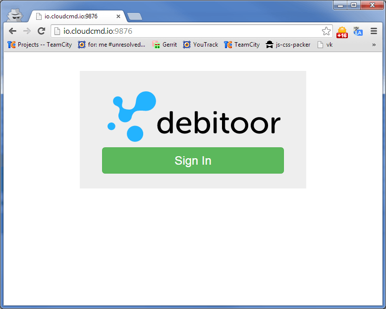
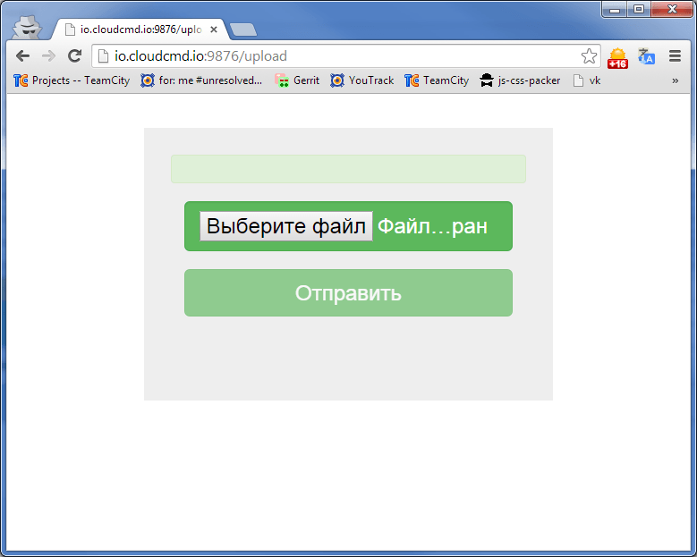

## Debit

Example of use [Debitoor](http://debitoor.com "Debitoor") [application](http://e-conomic.github.io/openvac/interview.html "Application").

```
As a small business owner, I want to import all my email contacts into 
my new invoicing and accounting system (Debitoor), so I can access them as
Customers and send them invoices.
```

## Start

```
> node index.js
> http://0.0.0.0:9876
```

## Sign In




## Upload



## License

MIT
